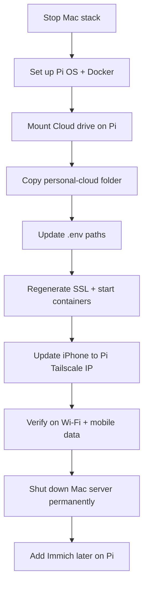

# Personal Cloud — Migration Guide

Move your Nextcloud + Nginx + Tailscale setup from Mac to **Raspberry Pi** (recommended) or an **old Android phone**.

Current Mac setup lives in `~/personal-cloud/` with data on `/Volumes/Cloud/`.

---

## What you are migrating

| Component | Mac location | Must copy? |
|-----------|--------------|------------|
| Docker config | `~/personal-cloud/` | Yes |
| Nextcloud user files | `/Volumes/Cloud/nextcloud/` | Yes |
| MariaDB database | `~/personal-cloud/db/` | Yes |
| Nextcloud config | `~/personal-cloud/nextcloud-config/` | Yes |
| SSL certificates | `~/personal-cloud/nginx/ssl/` | Yes |
| Immich folder (future) | `/Volumes/Cloud/immich/` | When you add Immich |

**Do not copy** from your old NTFS partitions (`Personal`, `Media`, etc.) unless you choose to later.

---

## Before you start (on Mac)

### 1. Stop the stack cleanly

```bash
cd ~/personal-cloud
docker compose down
```

### 2. Verify drive is safe to unplug

```bash
diskutil unmount /Volumes/Cloud
```

### 3. Pack these for the new device

**Folder A — project config (small, ~few hundred MB with DB):**

```
~/personal-cloud/
├── docker-compose.yml
├── .env
├── db/
├── nextcloud-config/
├── nginx/
└── scripts/
```

**Folder B — user files (large, on external drive):**

```
/Volumes/Cloud/nextcloud/    → your photos, PDFs, documents
/Volumes/Cloud/immich/       → empty for now, used when you add photo search
```

Copy Folder A via USB stick, `scp`, or `rsync` over the network.

---

## Option A — Raspberry Pi (recommended)

### Hardware checklist

- Raspberry Pi 5 (8 GB minimum, 16 GB if adding image search later)
- Official 27 W USB-C power supply
- Active cooler or fan case
- USB SSD (256 GB+) for OS + Docker + databases
- Your existing external HDD (Cloud partition, exFAT)
- Ethernet cable to router (preferred over Wi‑Fi for a server)

### Storage layout on Pi

```
/mnt/cloud/                  ← mount your exFAT "Cloud" partition here
├── nextcloud/               ← user files (from Mac)
└── immich/                  ← future photo ML storage

/home/pi/personal-cloud/     ← docker-compose project (from Mac)
├── db/                      ← MariaDB (keep on SSD, not HDD)
└── ...
```

Keep `db/` on the Pi's SSD boot drive for speed. Only bulk file storage goes on the HDD.

---

### Step 1 — Install Raspberry Pi OS

1. Download **Raspberry Pi Imager** on any computer.
2. Flash **Raspberry Pi OS (64-bit)** to your USB SSD (not microSD if you can avoid it).
3. In Imager advanced settings:
   - Set hostname: `cloud-pi`
   - Enable SSH
   - Set username/password
   - Configure Wi‑Fi (or use Ethernet)
4. Boot the Pi from USB SSD.

---

### Step 2 — Initial Pi setup

SSH into the Pi:

```bash
ssh pi@cloud-pi.local
```

Update system and install Docker:

```bash
sudo apt update && sudo apt upgrade -y
sudo apt install -y ca-certificates curl
curl -fsSL https://get.docker.com | sh
sudo usermod -aG docker $USER
```

Log out and back in so Docker group applies.

Install Tailscale:

```bash
curl -fsSL https://tailscale.com/install.sh | sh
sudo tailscale up
tailscale ip -4    # note this IP — e.g. 100.x.x.x
```

---

### Step 3 — Mount your external drive

Plug in the HDD. Find the partition:

```bash
lsblk -f
```

You should see `Cloud` (exFAT). Create mount point and mount:

```bash
sudo mkdir -p /mnt/cloud
sudo mount /dev/sda1 /mnt/cloud    # replace sda1 with your actual partition
ls /mnt/cloud    # should show nextcloud/ and immich/
```

**Auto-mount on boot** — get the UUID:

```bash
sudo blkid /dev/sda1
```

Add to `/etc/fstab`:

```
UUID=YOUR-UUID-HERE  /mnt/cloud  exfat  defaults,uid=1000,gid=1000,umask=0022  0  0
```

Test:

```bash
sudo mount -a
touch /mnt/cloud/.write_test && rm /mnt/cloud/.write_test && echo "Write OK"
```

---

### Step 4 — Copy project files to Pi

From your Mac (with Pi on same network):

```bash
rsync -avz --progress ~/personal-cloud/ pi@cloud-pi.local:~/personal-cloud/
```

If the HDD is already plugged into the Pi, `nextcloud/` data is already on `/mnt/cloud/nextcloud/` — no need to copy user files separately.

---

### Step 5 — Update `.env` on Pi

```bash
cd ~/personal-cloud
nano .env
```

Change to:

```env
CLOUD_DATA_PATH=/mnt/cloud/nextcloud
NC_HOST=<pi-lan-ip>
HTTP_PORT=80
HTTPS_PORT=443
```

Get Pi LAN IP:

```bash
hostname -I | awk '{print $1}'
```

---

### Step 6 — Fix file ownership

Docker runs Nextcloud as `www-data` (uid 33):

```bash
sudo chown -R 33:33 /mnt/cloud/nextcloud
sudo chown -R 999:999 ~/personal-cloud/db
```

---

### Step 7 — Update SSL cert for new IPs

On Pi, after Tailscale is running:

```bash
cd ~/personal-cloud
PI_IP=$(hostname -I | awk '{print $1}')
TS_IP=$(tailscale ip -4)
./scripts/regenerate-ssl.sh "$PI_IP" "$TS_IP"
```

---

### Step 8 — Start the stack

```bash
cd ~/personal-cloud
docker compose up -d
docker compose ps    # all three containers should be "Up"
```

Apply Nextcloud proxy settings:

```bash
PI_IP=$(hostname -I | awk '{print $1}')
./scripts/apply-nextcloud-proxy.sh "$PI_IP"
./scripts/add-tailscale-domain.sh
```

---

### Step 9 — Verify

On Pi:

```bash
curl -sk -o /dev/null -w "HTTPS: %{http_code}\n" https://localhost/
```

On iPhone:

1. Tailscale connected (same account).
2. Update Nextcloud app server URL to: `https://<pi-tailscale-ip>`
3. Accept certificate warning once.
4. Test upload/download on **Wi‑Fi** and **mobile data**.

---

### Step 10 — Auto-start on Pi boot

Docker starts automatically after install. Confirm containers restart:

```bash
docker compose ps
sudo reboot
# after reboot:
docker compose -f ~/personal-cloud/docker-compose.yml ps
```

Optional — disable Pi sleep / screen blanking:

```bash
sudo raspi-config
# Performance Options → disable screen blanking
```

---

### Step 11 — Shut down Mac server

Only after Pi is fully working:

```bash
# on Mac — do not run docker compose up again
cd ~/personal-cloud
docker compose down
```

Your iPhone should point at the **Pi's Tailscale IP**, not the Mac.

---

## Option B — Old Android phone

An old phone can work as a **basic** home server, but it is **not recommended** for image search or heavy use.

| | Raspberry Pi | Old phone |
|--|-------------|-----------|
| Always-on reliability | Good | Poor (battery, heat, OEM kill apps) |
| Docker support | Native | No — use Termux workarounds |
| USB drive support | Good | Limited / unstable |
| Image search (ML) | Pi 5 8–16 GB | Not realistic |
| Power use | ~5–8 W | Battery wear + charger |

Use a phone only if you want a **light experiment**, not a permanent cloud.

---

### Phone requirements

- Android 9+ (older is painful)
- 4 GB+ RAM (6 GB+ preferred)
- Charger permanently connected
- **Root not required** — Termux + proot

---

### Step 1 — Install Termux

1. Install **Termux** from [F-Droid](https://f-droid.org/en/packages/com.termux/) (not Play Store — outdated).
2. Open Termux and run:

```bash
pkg update && pkg upgrade -y
pkg install -y root-repo
pkg install -y proot-distro
proot-distro install debian
proot-distro login debian
```

You are now inside a Debian environment on the phone.

---

### Step 2 — Install Docker inside proot (Debian)

```bash
apt update && apt upgrade -y
apt install -y curl ca-certificates
curl -fsSL https://get.docker.com | sh
```

**Warning:** Docker in proot is unstable. Containers may crash when the phone sleeps or Termux is killed by Android.

Disable battery optimization for Termux:

- Android Settings → Apps → Termux → Battery → **Unrestricted**

---

### Step 3 — Storage on phone

Phones cannot reliably mount a USB HDD like a Pi.

Options:

| Option | Capacity | Reliability |
|--------|----------|-------------|
| Phone internal storage | Limited (64–128 GB) | OK |
| microSD in phone | More space | Wear / slow |
| USB OTG drive | Your HDD | Often disconnects |

If using internal storage:

```bash
mkdir -p /data/cloud/nextcloud
```

Copy files from Mac via `scp` or a USB OTG adapter + file manager.

---

### Step 4 — Copy project and start

Copy `~/personal-cloud/` from Mac to phone (Termux home):

```bash
# from Mac
scp -r ~/personal-cloud u0_a123@<phone-ip>:~/personal-cloud/
```

Update `.env`:

```env
CLOUD_DATA_PATH=/data/cloud/nextcloud
NC_HOST=<phone-lan-ip>
HTTP_PORT=8080
HTTPS_PORT=8443
```

Use ports 8080/8443 — Android blocks ports 80/443 without root.

Start:

```bash
cd ~/personal-cloud
docker compose up -d
```

---

### Step 5 — Tailscale on phone

Install **Tailscale** from Play Store (easier than Termux Tailscale).

Use Tailscale IP in the Nextcloud iPhone app. Remote access works the same way as Mac/Pi.

---

### Phone limitations to expect

- Termux killed overnight → server stops until you reopen the app
- No Immich ML / image search realistically
- Large file uploads may fail
- USB HDD will disconnect randomly
- **Use Pi for production; phone for testing only**

---

## After migration — iPhone checklist

- [ ] Tailscale installed and logged in (same account as server)
- [ ] Nextcloud app URL set to `https://<server-tailscale-ip>`
- [ ] Certificate warning accepted once
- [ ] Test upload on mobile data
- [ ] Test download on mobile data
- [ ] Mac stack stopped (`docker compose down`) to avoid confusion

---

## Adding image search later (Immich)

When ready on **Pi 5 8 GB+**, extend `docker-compose.yml`:

```yaml
  immich-redis:
    image: redis:7
    restart: unless-stopped
    networks: [cloud-net]

  immich-db:
    image: tensorchord/pgvecto-rs:pg16-v0.2.0
    restart: unless-stopped
    environment:
      POSTGRES_PASSWORD: <strong-password>
      POSTGRES_USER: immich
      POSTGRES_DB: immich
    volumes:
      - ./immich-db:/var/lib/postgresql/data
    networks: [cloud-net]

  immich-server:
    image: ghcr.io/immich-app/immich-server:release
    restart: unless-stopped
    ports:
      - "2283:2283"
    volumes:
      - /mnt/cloud/immich/upload:/usr/src/app/upload
    environment:
      DB_HOSTNAME: immich-db
      DB_USERNAME: immich
      DB_PASSWORD: <strong-password>
      DB_DATABASE_NAME: immich
      REDIS_HOSTNAME: immich-redis
    depends_on: [immich-db, immich-redis]
    networks: [cloud-net]

  immich-machine-learning:
    image: ghcr.io/immich-app/immich-machine-learning:release
    restart: unless-stopped
    volumes:
      - ./immich-model-cache:/cache
    networks: [cloud-net]
```

iPhone: install **Immich** app → server `http://<tailscale-ip>:2283` → enable backup.

Do **not** add Immich ML on an old phone.

---

## Quick reference — path changes

| Setting | Mac | Raspberry Pi | Old phone |
|---------|-----|--------------|-----------|
| `CLOUD_DATA_PATH` | `/Volumes/Cloud/nextcloud` | `/mnt/cloud/nextcloud` | `/data/cloud/nextcloud` |
| Project dir | `~/personal-cloud` | `~/personal-cloud` | `~/personal-cloud` |
| HTTPS ports | 80 / 443 | 80 / 443 | 8080 / 8443 |
| Remote URL | `https://100.x.x.x` | `https://100.x.x.x` | `https://100.x.x.x:8443` |
| Recommended | Trial | **Production** | Experiment only |

---

## Troubleshooting

| Problem | Fix |
|---------|-----|
| Permission denied on `/mnt/cloud` | `sudo chown -R 33:33 /mnt/cloud/nextcloud` |
| iPhone redirects to old Mac IP | Run `./scripts/apply-nextcloud-proxy.sh <new-ip>` on new server |
| Certificate warning on new device | Run `./scripts/regenerate-ssl.sh <lan-ip> <tailscale-ip>` and restart nginx |
| Containers won't start on Pi | `docker compose logs` — usually wrong path in `.env` |
| Drive not mounted after Pi reboot | Check `/etc/fstab` UUID entry |
| Termux dies on phone | Battery → Unrestricted for Termux; keep screen on while testing |

---

## Migration order (recommended)



---

*Guide version: matches Mac setup as of July 2026 — Nextcloud + Nginx + Tailscale, data on exFAT Cloud partition.*
